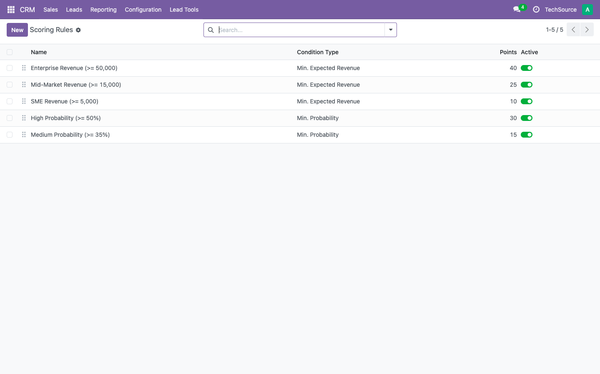
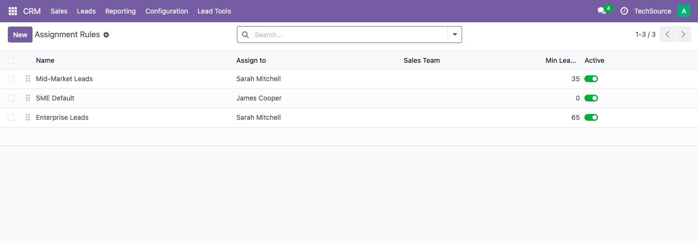
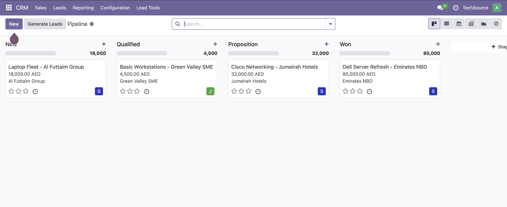
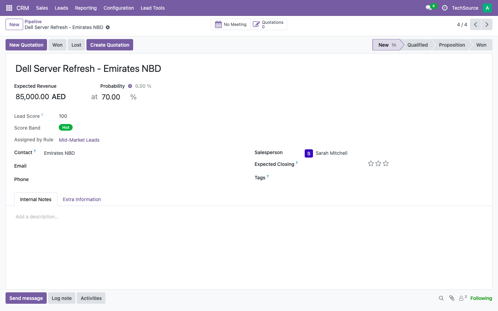
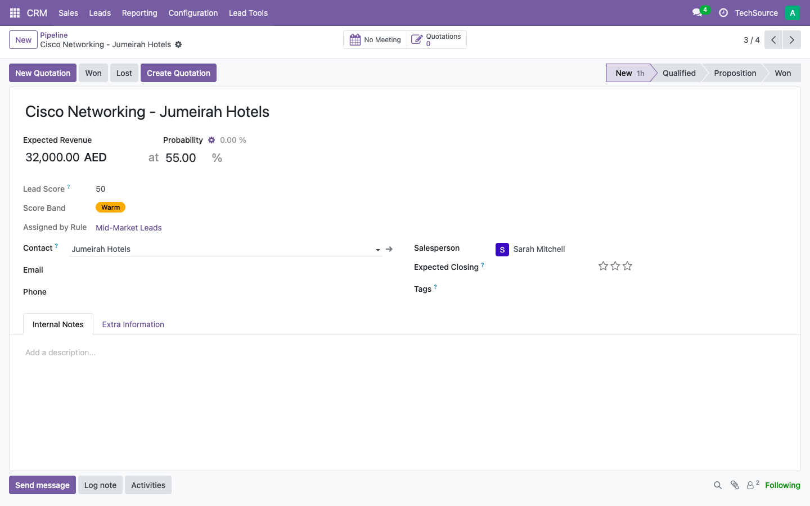
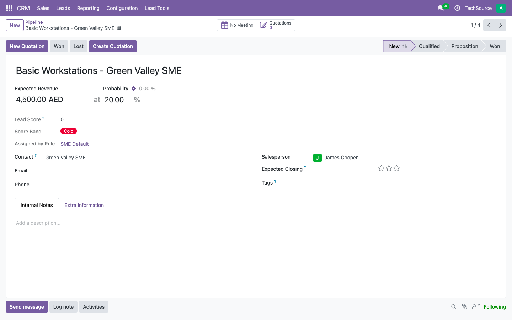
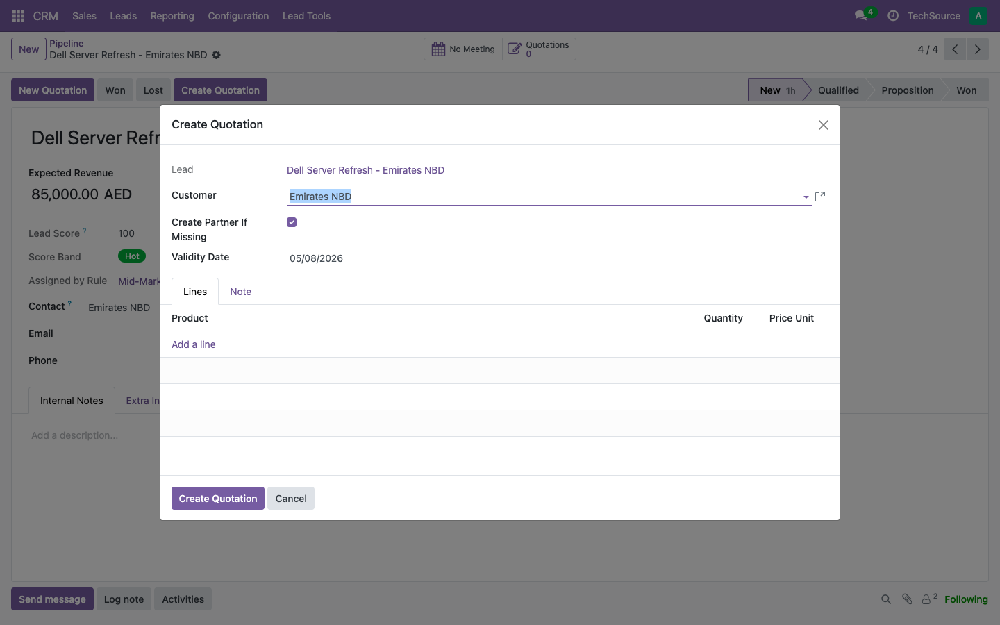

# odoo18-lead-to-quote

An Odoo 18 module that adds automatic lead scoring, rule-based salesperson assignment, and a guided quotation wizard to the CRM pipeline.


Built on Odoo 18 Community. Tested with the CRM and Sales apps.

---

## Table of Contents

- [What It Does](#what-it-does)
- [Screenshots](#screenshots)
- [Module Structure](#module-structure)
- [Demo Setup](#demo-setup--techsource-me)
- [Installation](#installation)
- [Workflow Overview](#workflow-overview)
- [Technical Notes](#technical-notes)
- [License](#license)
- [Author](#author)

---

## What It Does

### Lead Scoring

- Calculates a score for each opportunity based on configurable rules covering expected revenue and win probability
- Rules are additive — a lead can match multiple rules and accumulate points from each
- Displays a score band (Cold, Warm, or Hot) as a coloured badge on the opportunity form, visible without opening any extra views

### Auto-Assignment

- Evaluates assignment rules in order and routes each opportunity to the right salesperson automatically on creation
- Rules use a minimum score threshold — the first rule the lead qualifies for wins
- Records which rule triggered the assignment directly on the opportunity form, creating a transparent audit trail

### Create Quotation Wizard

- Adds a **Create Quotation** button to the opportunity form, visible only on qualified opportunities with no existing quote
- The wizard pre-fills the customer and validity date from the lead and lets you add product lines before confirming
- Creates the sale order and links it back to the opportunity without leaving the CRM record

---

## Screenshots

### Scoring Rules


Five active rules covering revenue tiers and probability bands. Points are additive — a lead with 85,000 AED revenue and 70% probability accumulates points across multiple matching rules.

### Assignment Rules


Three rules with minimum score thresholds. The engine picks the first rule the lead qualifies for, so Enterprise Leads at 65 points takes priority over Mid-Market Leads at 35.

### Pipeline Kanban


All four TechSource ME opportunities visible in the New stage. Each card shows the assigned salesperson avatar — James Cooper on the SME lead, Sarah Mitchell on the three higher-value deals.

### Hot Opportunity — Dell Server Refresh


85,000 AED at 70% probability scores 100 points. The Hot badge appears in the score group above the Contact section, and the Create Quotation button is ready in the action bar.

### Warm Opportunity — Cisco Networking


32,000 AED at 55% probability scores 50 points, landing in the Warm band. Assigned to Sarah Mitchell via the Mid-Market Leads rule.

### Cold Opportunity — Green Valley SME


4,500 AED at 20% probability scores 0 points. Cold band, routed to James Cooper via the SME Default rule with a minimum score of 0.

### Create Quotation Wizard


The wizard opens over the opportunity record. Customer pre-fills from the lead contact, validity date defaults to today, and product lines are added before confirming. A clean handoff from CRM to Sales without switching apps.

---

## Module Structure

```
lead_to_quote/
├── __manifest__.py
├── __init__.py
├── models/
│   ├── __init__.py
│   ├── lead_scoring_rule.py       # lead.scoring.rule — configurable scoring rules
│   ├── lead_assignment_rule.py    # lead.assignment.rule — first-match assignment
│   └── crm_lead.py                # crm.lead extension — score, band, assignment
├── wizard/
│   ├── __init__.py
│   └── quote_from_lead_wizard.py  # quote.from.lead.wizard
├── views/
│   ├── lead_scoring_rule_views.xml
│   ├── lead_assignment_rule_views.xml
│   ├── crm_lead_views.xml         # Score group xpath, Create Quotation button
│   └── quote_wizard_views.xml
├── security/
│   └── ir.model.access.csv
└── static/src/img/screenshots/
```

---

## Demo Setup — TechSource ME

The screenshots use a demo database built around TechSource ME, an IT hardware distributor based in Dubai. The setup maps directly to how the module works in practice: high-value enterprise deals route to the senior rep, smaller SME leads go to a junior rep.

**Scoring rules:**

| Rule | Condition | Points |
|---|---|---|
| Enterprise Revenue (>= 50,000) | Min. Expected Revenue | 40 |
| Mid-Market Revenue (>= 15,000) | Min. Expected Revenue | 25 |
| SME Revenue (>= 5,000) | Min. Expected Revenue | 10 |
| High Probability (>= 50%) | Min. Probability | 30 |
| Medium Probability (>= 35%) | Min. Probability | 15 |

**Assignment rules:**

| Rule | Min Score | Salesperson |
|---|---|---|
| Enterprise Leads | 65 | Sarah Mitchell |
| Mid-Market Leads | 35 | Sarah Mitchell |
| SME Default | 0 | James Cooper |

**Opportunities and results:**

| Opportunity | Revenue | Probability | Score | Band | Assigned To |
|---|---|---|---|---|---|
| Dell Server Refresh - Emirates NBD | 85,000 AED | 70% | 100 | Hot | Sarah Mitchell |
| Cisco Networking - Jumeirah Hotels | 32,000 AED | 55% | 50 | Warm | Sarah Mitchell |
| Laptop Fleet - Al Futtaim Group | 18,000 AED | 40% | 40 | Warm | Sarah Mitchell |
| Basic Workstations - Green Valley SME | 4,500 AED | 20% | 0 | Cold | James Cooper |

---

## Installation

```bash
git clone https://github.com/mayuri2392/odoo18-lead-to-quote ~/Projects/odoo18/custom_addons/lead_to_quote
```

Restart Odoo, enable developer mode, then install **Lead to Quote** from the Apps menu.

**To upgrade after pulling changes:**

```bash
.venv/bin/python odoo-bin -c odoo.conf -d <your_db> -u lead_to_quote --stop-after-init
```

**Post-install setup:**

1. Go to **Lead Tools → Scoring Rules** and create your revenue and probability rules
2. Go to **Lead Tools → Assignment Rules** and set minimum score thresholds per salesperson
3. Create or convert a lead to an opportunity — score and assignment calculate on save

---

## Workflow Overview

### Scoring and Assignment

1. A lead is created or converted to an opportunity
2. On save, the module evaluates all active scoring rules and sums the matching points
3. The total score maps to a band: Cold (0–34), Warm (35–64), Hot (65+)
4. Assignment rules run in order — the first rule whose minimum score the lead meets sets the salesperson
5. Score, band, and the triggering rule name all appear on the opportunity form above the Contact section

### Creating a Quotation

1. Open a qualified opportunity with no existing quotation
2. Click **Create Quotation** in the action bar
3. In the wizard, confirm the customer, set a validity date, and add product lines
4. Click **Create Quotation** — the sale order is created and linked back to the opportunity

---

## Technical Notes

- Score fields (`lead_score`, `score_band`, `assigned_by_rule`) are computed and stored on `crm.lead` so they appear in list views and filters.
- The score group uses an xpath targeting `//group[group[@name='lead_partner']]` with `position="before"` to place the score fields cleanly above the Contact section.
- The Create Quotation button uses `invisible="type != 'opportunity' or quotation_count > 0"` — Odoo 18 Python boolean syntax, no `attrs={}`.
- Score fields only populate after opportunity conversion. Expected Revenue is the key trigger for revenue-based scoring rules.
- Compatible with Odoo 18 Community. No Docker required for local development.
- Stage flow reuses the native crm.stage model and standard Pipeline kanban; no custom stage logic.

---

## License

[LGPL-3](LICENSE)

---

## Author

**Mayuri Patil** — Odoo Functional + Technical Consultant

6 years across B2B retail, logistics, and perishable goods. Open to EU roles.

[](https://linkedin.com/in/mayuri-patil-2392)
[](https://github.com/mayuri2392)